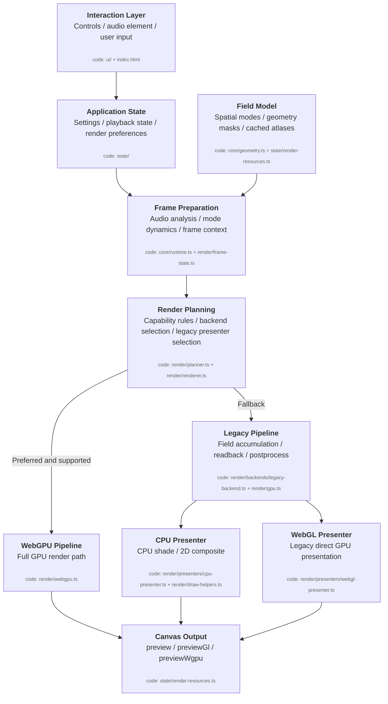

# Architecture Overview

SeeSound is split into a browser visualizer and an optional macOS companion. The browser app owns interaction, audio analysis, rendering, and presentation. The companion is only needed for the `Desktop App` source mode.

## Browser App Layers

## Audio Input Paths

- `File`: local browser playback through `HTMLAudioElement`, `AudioContext`, and `AnalyserNode`.
- `Browser Tab`: `getDisplayMedia({ audio: true, video: true })` feeds a `MediaStreamAudioSourceNode`.
- `Desktop App`: the macOS companion captures system audio with `ScreenCaptureKit`, streams PCM over localhost WebSocket, and the browser feeds that data into an `AudioWorklet`.

`File` remains the lowest-latency baseline. Desktop audio is useful, but it has unavoidable capture and bridge stages.
