# Render Flow

This is the per-frame path for the browser renderer.

```mermaid
flowchart TD
  A["<b>Frame Tick</b><br/>requestRender / animation tick<br/><br/><span style='font-size:11px;color:#666'>code: render/renderer.ts</span>"]
  A --> B["<b>Audio Analysis</b><br/>Read analyser -> bands / rms / centroid<br/><br/><span style='font-size:11px;color:#666'>code: core/runtime.ts</span>"]

  B --> C["<b>Frame Preparation</b><br/>Update mode dynamics / prepare render params / ensure spatial atlas<br/><br/><span style='font-size:11px;color:#666'>code: render/frame-state.ts</span>"]
  C --> D["<b>Render Planning</b><br/>Resolve backend and legacy presenter<br/><br/><span style='font-size:11px;color:#666'>code: render/planner.ts</span>"]

  D --> E{"<b>WebGPU supported and selected?</b>"}

  E -->|yes| F["<b>WebGPU Render</b><br/>Field pass -> reduction -> background -> contour -> glow/isoline present<br/><br/><span style='font-size:11px;color:#666'>code: render/webgpu.ts</span>"]
  F --> G["<b>Present WebGPU Frame</b><br/>Display to previewWgpu<br/><br/><span style='font-size:11px;color:#666'>code: render/webgpu.ts</span>"]

  E -->|no| H["<b>Legacy Field Accumulation</b><br/>Prepare legacy field data<br/><br/><span style='font-size:11px;color:#666'>code: render/backends/legacy-backend.ts</span>"]

  H --> I{"<b>GPU accumulation available?</b>"}
  I -->|yes| J["<b>WebGL Accumulate</b><br/>Accumulate field on GPU<br/><br/><span style='font-size:11px;color:#666'>code: render/gpu.ts</span>"]
  I -->|no| K["<b>CPU Accumulate</b><br/>Accumulate field on CPU<br/><br/><span style='font-size:11px;color:#666'>code: render/backends/legacy-backend.ts</span>"]

  J --> L["<b>Optional Readback</b><br/>Read field / glow accumulation to CPU when needed<br/><br/><span style='font-size:11px;color:#666'>code: render/backends/legacy-backend.ts + render/gpu.ts</span>"]
  K --> M["<b>Legacy Postprocess</b><br/>Residual / percentile and related postprocess<br/><br/><span style='font-size:11px;color:#666'>code: render/backends/legacy-backend.ts</span>"]
  L --> M

  M --> N{"<b>Use WebGL presenter?</b>"}
  N -->|yes| O["<b>WebGL Present Attempt</b><br/>Direct GPU shade / present for legacy glow path<br/><br/><span style='font-size:11px;color:#666'>code: render/presenters/webgl-presenter.ts</span>"]
  N -->|no| P["<b>CPU Shade</b><br/>Shade field on CPU<br/><br/><span style='font-size:11px;color:#666'>code: render/presenters/cpu-presenter.ts</span>"]

  O --> Q{"<b>Direct present succeeded?</b>"}
  Q -->|yes| R["<b>Legacy Composite</b><br/>Overlay contours / frame / final 2D composition<br/><br/><span style='font-size:11px;color:#666'>code: render/presenters/cpu-presenter.ts + render/draw-helpers.ts</span>"]
  Q -->|no| P

  P --> R
  R --> S["<b>Present Legacy Frame</b><br/>Display to preview / previewGl<br/><br/><span style='font-size:11px;color:#666'>code: state/render-resources.ts</span>"]
```

Dedicated visual modes branch before this spectral render plan:

- `Crystal` renders through `render/crystal-webgpu.ts`.

The dedicated crystal renderer currently depends on WebGPU support.
